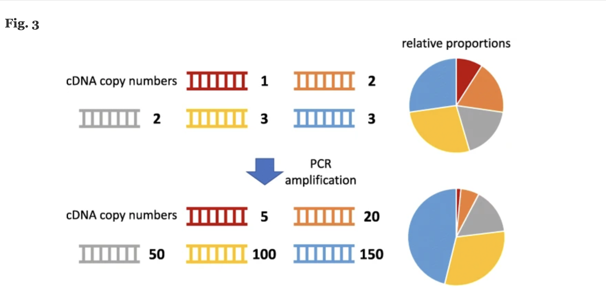

# Psedocode

## Define the problem

#### Why PCR?

We are trying to remove PCR duplicates from our sam files (e.g., a reference based removal tool). PCR amplification is used in many library preparations because it increases the reads per-well on the sequencer. This increases the overall signal i.e. per-base confidence of the sequencer.

#### PCR drawbacks

A drawback of PCR amplification is that PCR duplicates run the risk of obscuring the actual sequencing data and any downstream differential expression analysis. This is because PCR is biased to duplicate certain kinds of reads. I've included a visualization here for clarification.

[source](https://genomebiology.biomedcentral.com/articles/10.1186/s13059-022-02601-5)

#### The impact of the tool being referenced-based

Becuase removal tool is reference based, this greatly reduces the number of duplicates. This is because the vast majority of nonstandard PCR duplicates (primer dimers, repeats, etc.) will have be filtered out by the alignment step. The problem now is that the remaining duplicates are very similar to our reference. Thus we cannot determine PCR duplicates by sequence-content. Instead we will determine them with duplicated meta-information (identical chromosome, UMI, and position). Some notable caveats:

- Any reads with unknown UMIS will be discarded.
There is no need to look at content, because PCR duplicate sequence content will be indistinguishable from differential expression sequence content.
- Because we are dealing with single-end data, we only need to examine one read or sam line at a time.

## Possible cases:

- Case 1, **duplicate**: Two reads have the same chromosome, same starting position (after softclipping adjustment), same strand, and the same UMI.
    - Read length, content, and quality are not checked.
- Case 2, **not a duplicate**: Two reads are the same, except their chromosomes are different.
    - This case is handled by the sorting method which groups reads by chromosome and UMI. So, reads with different chromosomes would be in different bins from the start (and thus be treated uniquely).

- Case 3, **not a duplicate**: Two reads are the same, but they are on different strands.
    - This case is handled by my code logic, because reads are checked against a set that only contains reads from the + or - strand. So, both reads would be unique for their set.

- Case 4, **not a duplicate**: Two reads are the same, but they have different positions (after soft clipping adjustment).
    - This case is handled by my code logic, because the final duplication check is by position, and reads at different positions are considered distinct.

- Case 5, **not a duplicate**: Two reads are the same, but they have a different UMIs
    - This case is handled by my sorting method which groups reads by chromosome and UMIs. So similar to case 2, reads with different UMIS would be in different bins from the start.

## Write examples:

- input sam file: [link](unit_tests/mini_test_input.sam)
- output sam file: [link](unit_tests/mini_test_output.sam)
- explanation of cases covered by said files: [link](unit_tests/README.md)

```bash
cat test.sam | grep -v "@" | sort -t ':'  -k 8 | sort -k 3 -s
```

```bash
In bash, sort by chromosome-umi saving to sorted.sam

driver function(input_file, header_file, umi_file):
    chrom=""
    UMI=""
    plus_position_set=()
    minus_position_set=()
    output_file=open(output.sam)
    #write header right away because its unchanged
    output_file.write(open(header_file).read())
    #set of all UMIS provided
    all_umis=set(open(umi_file).read().split("\t"))
    #read through input_file
    for line in input_file:
        curr_chrom, curr_UMI= get_umi_and_chrom(line)

        #if unknown UMI, trash
        if curr_UMI not in all_umis:
            continue

        #if you have to update anything, clear the positions
        if curr_chrom!=chrom:
            chrom=curr_chrom
            plus_position_set=()
            minus_position_set=()
        if curr_UMI!=UMI:
            UMI=curr_UMI
            plus_position_set=()
            minus_position_set=()

        #if we have to handle soft clipping    
        if S in start of cigar_string:
            adjusted_position=fix_softclipping(line)
        #otherwise can use og position
        else:
            adjusted_position=line.split()[4]
        
        #get what strand we are on
        pos_strand=determine_strand(line)

        #check existance of this position in the set, only by strand
        #+
        if pos_strand:
            #if a new read
            if adjusted_position not in plus_position_set:
                #add to set
                plus_position_set.insert(adjusted_position)
                #write to file
                output_file.write(line)
            else:
                #discard read, its a dupe
                pass
        #-
        else:
            #if a new read
            if adjusted_position not in minus_position_set:
                #add to set
                minus_position_set.insert(adjusted_position)
                #write to line
                output_file.write(line)
            else:
                #discard read, its a dupe   
                pass
```

## Function definitions

#### Extract the UMI and chromosme

```bash
def get_umi_and_chrom(string line):
    """From one line in our sam file, extract the UMI and Chromosome
    """
    return string UMI, string Chromosome
```

**Example:** 

Input: `C1:154:HWKTMBGXX:1:11101:10266:1114:ATCGAACC	0	2	76875957	36	25M470N46M	*	0	0	GTGAAACTCGGTGGGATGAGGCGCTCTTTTATATTGAGTTGGGCTGTGCAGGAGTCTTTTCCCACTTCATT	6<EAEEEEEEEEEEEEEEEEEEEEEEEEEEEEEEEEEEEEEEEEEEEEEEEEEEEEEEEEAEEAEEEEEEE	MD:Z:71	NH:i:1	HI:i:1	NM:i:0	SM:i:36	XQ:i:40	X2:i:0	XO:Z:UU	XS:A:-	XG:Z:A`

Output: `ATCGAACC`, `2`

```bash
def fix_softclipping(string line):
"""On a line determined to have leftmost softclipping, use the CIGAR string and
softclipped starting position to extract the true start position of our read.
"""
return int start_position
```

Input: `C4(SC):154:HWKTMBGXX:1:11101:10266:1114:ATCGAACC	0	2	76875958	36	1S24M470N46M	*	0	0	GTGAAACTCGGTGGGATGAGGCGCTCTTTTATATTGAGTTGGGCTGTGCAGGAGTCTTTTCCCACTTCATT	6<EAEEEEEEEEEEEEEEEEEEEEEEEEEEEEEEEEEEEEEEEEEEEEEEEEEEEEEEEEAEEAEEEEEEE	MD:Z:71	NH:i:1	HI:i:1	NM:i:0	SM:i:36	XQ:i:40	X2:i:0	XO:Z:UU	XS:A:-	XG:Z:A`

Output: `76875957`

```bash
def determine_strand(line):
"""From a sam line, extract the bitscore and determine which strand our read lies on
"""
return bool strand (True if positive, False if negative strand)
```

Input: `C4(SC):154:HWKTMBGXX:1:11101:10266:1114:ATCGAACC	0	2	76875958	0	1S24M470N46M	*	0	0	GTGAAACTCGGTGGGATGAGGCGCTCTTTTATATTGAGTTGGGCTGTGCAGGAGTCTTTTCCCACTTCATT	6<EAEEEEEEEEEEEEEEEEEEEEEEEEEEEEEEEEEEEEEEEEEEEEEEEEEEEEEEEEAEEAEEEEEEE	MD:Z:71	NH:i:1	HI:i:1	NM:i:0	SM:i:36	XQ:i:40	X2:i:0	XO:Z:UU	XS:A:-	XG:Z:A`
Output: False (this line is on the **negative** strand).